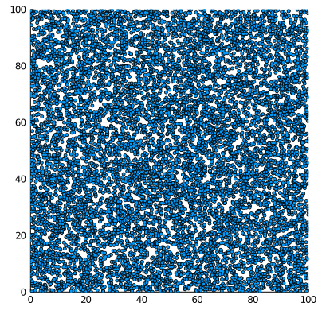

## Geração de posições para as 10_000 partículas dos exercícios 31 e 32.

```julia
import Random
Random.seed!(321)
p = [ 100*rand(2) for i in 1:10_000 ]
```

```julia
using Plots
x = [ p[i][1] for i in 1:length(p) ]
y = [ p[i][2] for i in 1:length(p) ]
scatter(x,y,label="",size=(400,400),xlim=(0,100),ylim=(0,100),markersize=3)
savefig("ex3132.png")
```



## Energia potencial 

Vamos usar aqui o potencial de Lennard-Jones, com parâmetros
`σ = 0.5` e `ε = 2.0`, e um raio de corte de `2.0`. Consideraremos
que o sistema é periódico, com lado 10. 

Energia potencial total esperada = `2.622711401169357e24`

Performance aproximada (depende dos detalhes da implementação, aqui
apresento a do código que calcula o potencial apenas quando a distância
é menor que o raio de corte:

```julia
 1.374 s (0 allocations: 0 bytes)
```

Calculando o mesmo conjunto de interações, mas o método das células
ligadas, usando condições periódicas de contorno, temos:

```julia
 25.973 ms (0 allocations: 0 bytes)
```

Ou seja, o código com células ligadas é cerca de 50 vezes mais rápido. 


