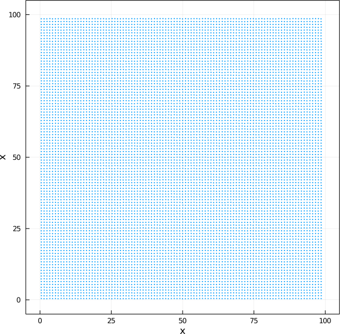

## Geração de posições para as 10_000 partículas dos exercícios 31 e 32.

```julia
include("./initial-point.jl")
p = initial_point(10_000,100,0.9)
```



## Energia potencial 

Vamos usar aqui o potencial de Lennard-Jones, com parâmetros
`σ = 0.5` e `ε = 5.0`, e um raio de corte de `2.0`. Consideraremos
que o sistema é periódico, com lado 10. 

Energia potencial total esperada = `-7472.164849146468`

Performance aproximada (depende dos detalhes da implementação, aqui
apresento a do código que calcula o potencial apenas quando a distância
é menor que o raio de corte:

```julia
 717.488 ms (0 allocations: 0 bytes)

```

Calculando o mesmo conjunto de interações, mas o método das células
ligadas, usando condições periódicas de contorno, temos:

```julia
 5.606 ms (0 allocations: 0 bytes)
```

Ou seja, o código com células ligadas é cerca de 150 vezes mais rápido. 


