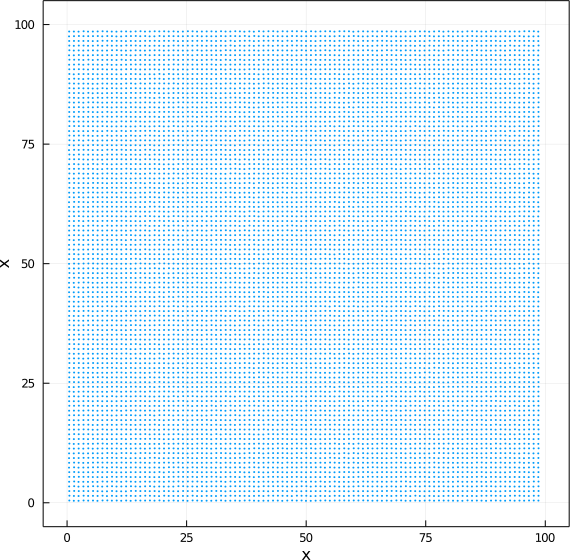

# Função geradora de coordenadas iniciais

A geração de coordenadas iniciais para uma simulação com potenciais de
Lennard-Jones é delicada, porque os potenciais explodem em distâncias
curtas devido ao termo 1/r^2. Em aplicações práticas, hoje em dia,
usa-se o software [Packmol](http://m3g.iqm.unicamp.br/packmol) para
gerar as configurações iniciais ou, alternativamente, usam-se
coordenadas pré-equilibradas. Normalmente, ainda, minimiza-se a energia
do sistema antes de iniciar a simulação, para afastar os átomos que por
ventura estejam muito próximos.  

Aqui vamos usar uma estratégia mais simples, mas que era muito usada no
passado: gerar uma configuração na qual as partículas estão organizadas
em uma rede regular. O código em [initial_point.jl](initial_point.jl)
faz isso, introduzindo ainda algumas perturbações nas posições dos
átomos gerados na rede. As perturbações são feitas garantindo que a
distância mínima entre os átomos não seja menor que uma tolerância
definida pelo usuário. 

Para gerar os pontos com esta função, use, por exemplo:
```julia
include("./initial_point.jl")
p = initial_point(10_000,100,0.9)
```
Neste caso, geraremos 10 mil pontos em uma rede quadrada de lado 100,
garantindo que a distância entre eles não seja menor que 0.9. 

Os pontos gerados podem ser desenhados em um gráfico, convertendo as
coordenadas em vetores:

```julia
x = [ p[i][1] for i in 1:10_000 ] 
y = [ p[i][2] for i in 1:10_000 ] 
scatter(x,y,label="",lims=(-5,105),
        xlabel="x",ylabel="y",
        markersize=2,markerstrokewidth=0,
        aspect_ratio=1,framestyle=:box,size=(600,600))
```

Resultando em:


## Novidades do código

Chamemos a atenção para algumas características do código
[initial_point.jl](initial_point.jl). 

### Palavras-chave

Primeiro, ele pode receber um parâmetro adicional, que é a semente do
gerador de números aleatórios:

```
p = initial_point(10_000,100,0.9)
```

Isto é permitido definindo a função da seguinte forma:
```
initial_point(N,side,tol;seed=123)
```

O parâmetro opcional que pode ser fornecido literalmente como
palavra-chave (keyword) está escrito depois de um ponto-e-vírgula, e
assume o valor padrão `123` se não for fornecido. Aqui sempre usaremos o
valor padrão para que os resultados sejam reprodutíveis. Para gerar
pontos diferentes em cada execução, use `seed=-1`.

### O campo de comentários e ajuda

Note que a função `initial_point` no código é precedida por uma
descrição que está contida entre aspas triplas. Algo como:
```
"""

initial_point ...

"""
```

Estes não são apenas comentários no código. Estes comentários também
formam o campo ajuda da função que evocado no REPL quando usamos `?`:

```julia
julia> include("./initial_point.jl")
initial_point

help?> initial_point
search: initial_point

  initial_point(N,side,tol;seed=123)

  Generates a grid of N particles in a square of side side, with
  perturbed coordinates but
  which satisfy a minimum distance greater than tol 

  N: number of particles.

  side: side of the square

  tol: minimum distance allowed between particles

  The optional keyword parameter seed, if set to -1, produces a random
  seed at each run.

  Example
  =========

  Generate 10_000 points in a grid of side 100, with a guaranteed
  minimum distance greater
  than 0.5:

  p = initial_point(10_000,100,0.5)

  Use a random seed:

  p = initial_point(10_000,100,0.5,seed=-1)

```
